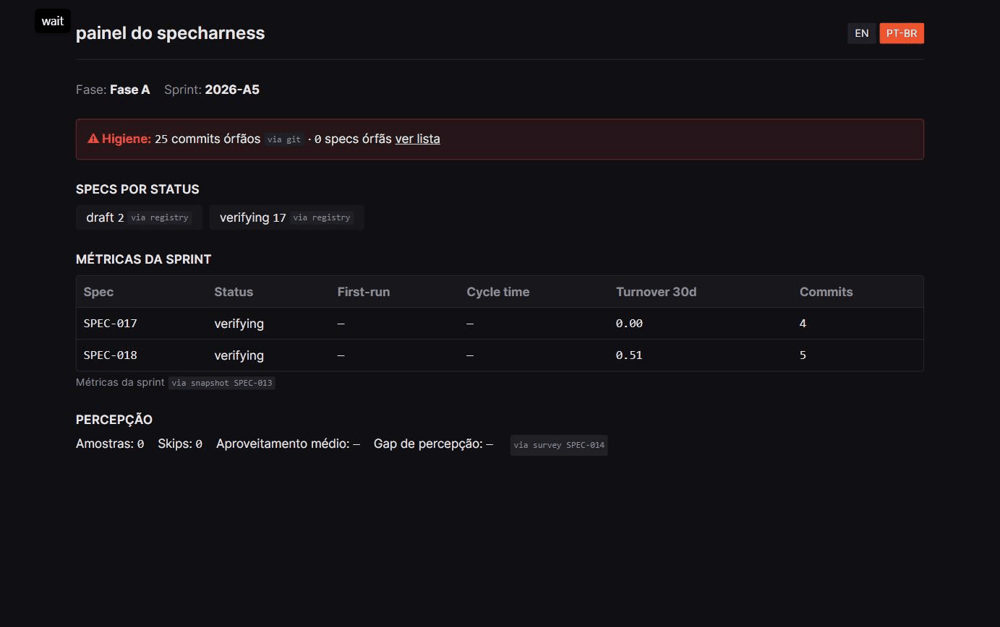
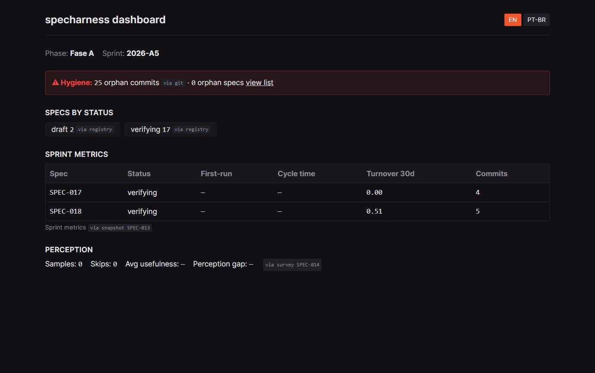

<p align="center">
  <br>
  
</p>

<p align="center">
  <a href="LICENSE"></a>
  
  
  
</p>

# specharness

> **From first idea to final report:** the open source decision, quality and
> metrics layer for Spec-Driven Development with coding agents.

specharness closes the loop that today is fragmented across meetings, Word
docs, trackers and improvised agent setups:

1. **Before code** — no US/spec reaches your coding agent without passing an
   automated Definition of Ready (deterministic checks + LLM review with a
   readiness score).
2. **During code** — commits, PRs and CI are linked to specs via git trailers;
   BDD scenarios gate "done"; objective metrics are collected automatically.
3. **After code** — developer perception is sampled at merge, code survival is
   tracked over 30/90 days, and everything comes back organized: dashboard,
   sprint reports, living documentation.

**Bring your own everything:** your database (SQLite default, Postgres
optional), your tracker (Redmine, GitHub Issues, Jira Cloud — Azure DevOps
next), your git provider, your coding agent (Claude Code, Codex, Kimi) and
your LLM (any API provider or local models via Ollama). Self-hosted, your
data stays with you.

**The thesis, verifiable in your own data:** specs that enter ready produce
code that survives. specharness instruments the correlation
*readiness × turnover × perception* end to end.

## See it running

The dashboard below is specharness observing **its own development** (real
dogfooding data): specs by status from the registry, sprint metrics from git +
CI artifacts, and a hygiene banner for commits missing a `Spec:` trailer.
Every number carries a provenance chip — nothing is self-reported.

<p align="center">
  
</p>

<details>
<summary>Static screenshots (EN / pt-BR)</summary>




</details>

## Status

Pre-alpha, Fase A in progress. The full backlog lives in [`specs/`](specs/) —
this project is developed with its own methodology (every commit carries a
`Spec:` trailer, every done spec has green BDD). Read
[`specs/SPEC-001-founding-document.md`](specs/SPEC-001-founding-document.md)
for the complete vision and
[`specs/SPEC-002-dev-stack.md`](specs/SPEC-002-dev-stack.md) for the stack.

## Quickstart (development)

Requirements: [uv](https://docs.astral.sh/uv/), git, and
[just](https://github.com/casey/just) (`uv tool install rust-just` works
anywhere uv does). An LLM is required (ADR-006): bring an API key (Anthropic,
OpenAI or Azure) or a local [Ollama](https://ollama.com) — without one, the
Readiness Gate stays blocked. Node 20+ is needed only to build the embedded
dashboard (`just build-web`); `just dev` serves the API without it.

```bash
git clone https://github.com/caio-moliveira/specharness && cd specharness
just setup     # uv sync + pre-commit hooks
just test      # full suite — should be green
just dev       # API at http://localhost:8321 (docs at /docs)
```

Working with Claude Code? Open the repo and go — `AGENTS.md`, `CLAUDE.md`,
skills and hooks are already wired. Try: *"implemente a SPEC-004 seguindo a
skill escrever-spec para qualquer ajuste na spec antes"*.

## Repository map

```
packages/core       domain: spec schema, parser, lifecycle, gates (pure Python)
packages/cli        specharness CLI (Typer)
packages/server     web API (FastAPI)
packages/adapters   trackers, git providers, LLM, importers
packages/metrics    metric snapshots and queries
specs/              the backlog — specs with BDD + success metrics (dogfooding)
evals/              golden datasets for every LLM task
profiles/           harness best-practice packs per coding agent (data, not code)
docs/adrs/          every architecture decision, with alternatives considered
brand/              visual identity: H-gate logo, tokens, usage rules (ADR-017)
.claude/            the dev harness: skills, hooks, permissions
```

## Contributing

Start with [CONTRIBUTING.md](CONTRIBUTING.md). The canonical
good-first-issue: updating a harness profile when a vendor's official
practices change (source URL required — ADR-004).

## License

[Apache 2.0](LICENSE)
